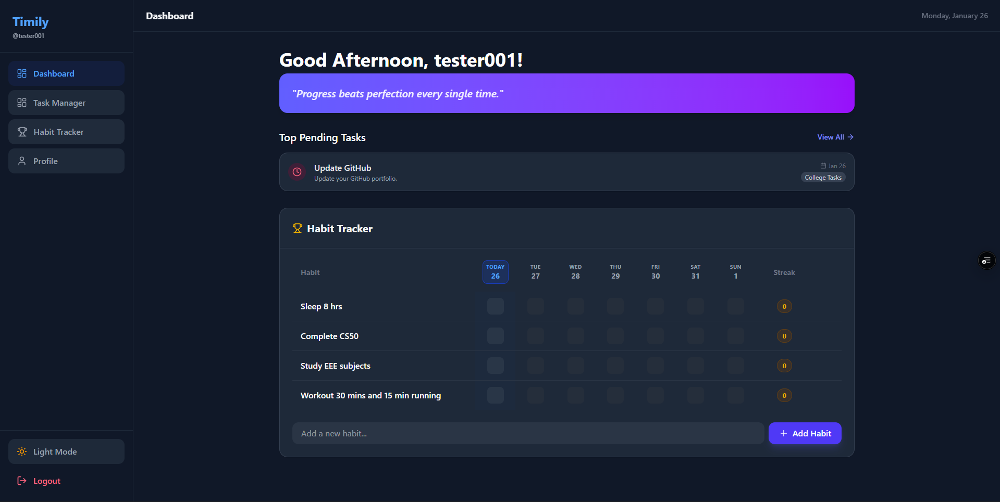
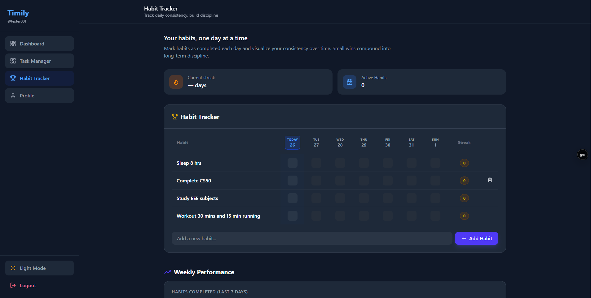
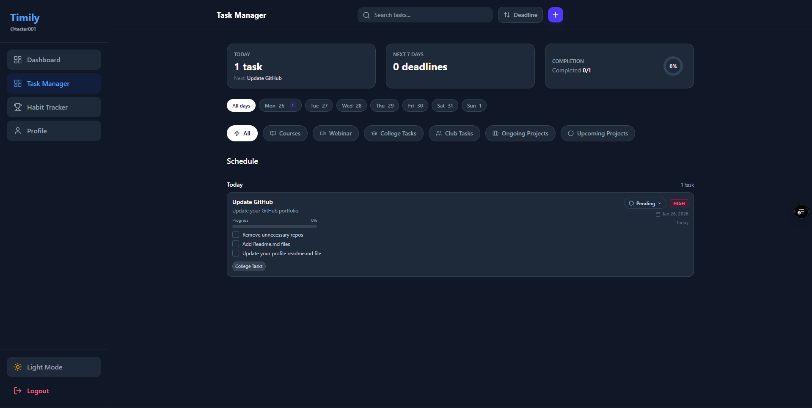

# 🚀 Timely - Personal Development & Productivity Tracker

<div align="center">


**Timely** is an immersive, gamified personal training and character development platform designed to help users organize their lives and level up their habits. Built with the MERN stack, it combines robust task management with detailed habit tracking analytics in a modern, glassmorphic UI.

[View Demo](#) · [Report Bug](#) · [Request Feature](#)

</div>

---

## ✨ Key Features

### ✅ Task Manager
Stay on top of your daily goals with a sleek task management interface.
- **CRUD Operations**: Easily add, edit, delete, and mark tasks as complete.
- **Priority & Categorization**: Organize tasks by importance and category.
- **Intuitive UI**: Smooth animations and clean design for a distraction-free experience.

### 📊 Habit Tracker & Analytics
Build consistency with powerful tracking tools.
- **Daily Logging**: Mark habits as done and track your streaks.
- **Visual Analytics**: Interactive charts (powered by Recharts) to visualize weekly performance and completion trends.
- **Consistency Score**: Monitor your discipline over time.

### 👤 User Profile & Customization
- **Personalized Profile**: Update user details and profile pictures (integrated with Cloudinary).
- **Secure Authentication**: JWT-based auth with strict security practices.

---

## 📸 Interface Preview

<div align="center"> 
  <h3>Dashboard Overview</h3>
  
  <br><br>
</div>

<div align="center">
  <h3>Habit Tracker & Analytics</h3>
  
  <br><br>
</div>

<div align="center"> 
  <h3>Task Management</h3>
  
</div>

---

## 🛠️ Tech Stack

<table align="center">
  <tr>
    <td align="center" width="96">
      <a href="https://reactjs.org/">
        
      </a>
      <br>React
    </td>
    <td align="center" width="96">
      <a href="https://tailwindcss.com/">
        
      </a>
      <br>Tailwind
    </td>
     <td align="center" width="96">
      <a href="https://nodejs.org/">
        
      </a>
      <br>Node.js
    </td>
    <td align="center" width="96">
      <a href="https://www.mongodb.com/">
        
      </a>
      <br>MongoDB
    </td>
    <td align="center" width="96">
      <a href="https://recharts.org/">
        
      </a>
      <br>Recharts
    </td>
  </tr>
</table>

### Frontend
- **Framework**: React (Vite)
- **Styling**: Tailwind CSS, Glassmorphism Design
- **State Management**: Context API
- **Visualization**: Recharts, React Circular Progressbar
- **Notifications**: React Toastify

### Backend
- **Server**: Express.js
- **Database**: MongoDB (Mongoose ODM)
- **Authentication**: JWT & Bcrypt
- **Image Storage**: Cloudinary

---

## 🚀 Getting Started

Follow these steps to set up the project locally.

### Prerequisites
- Node.js (v14+)
- MongoDB (Local or Atlas URI)
- Cloudinary Account

### Installation

1. **Clone the repository**
   ```bash
   git clone https://github.com/yourusername/timely.git
   cd timely
   ```

2. **Install Dependencies**
   ```bash
   # Install backend dependencies
   cd backend
   npm install

   # Install frontend dependencies
   cd ../frontend
   npm install
   ```

3. **Environment Setup**
   Create a `.env` file in the `backend` directory:
   ```env
   PORT=5000
   MONGO_URI=your_mongodb_connection_string
   JWT_SECRET=your_jwt_secret
   CLOUDINARY_CLOUD_NAME=your_cloud_name
   CLOUDINARY_API_KEY=your_api_key
   CLOUDINARY_API_SECRET=your_api_secret
   ```

   Create a `.env` file in the `frontend` directory:
   ```env
   VITE_BACKEND_URL=http://localhost:8000
   ```

4. **Run the Application**
   ```bash
   # Start Backend (from backend dir)
   npm run dev

   # Start Frontend (from frontend dir)
   npm run dev
   ```

---

## 🔮 Future Roadmap

- [ ] Gamification System (XP, Levels, Badges)
- [ ] Social Features (Leaderboards, Challenges)
- [ ] Mobile App (React Native)
- [ ] AI-powered Task Suggestions

---

## 🤝 Contributing

Contributions are welcome! Please fork the repo and create a pull request with your improvements.

## 📄 License

This project is licensed under the MIT License.
